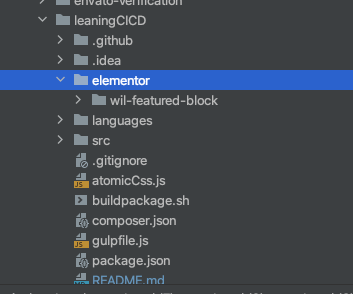
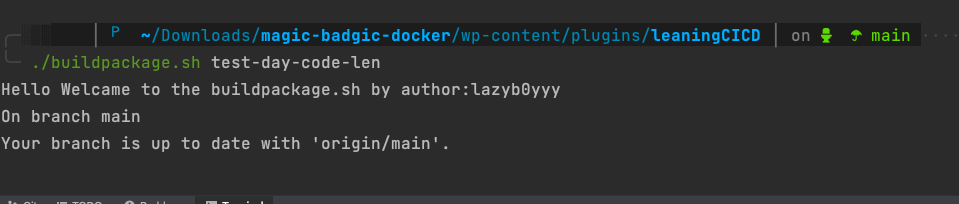

#Quy trình setup đẩy plugin tự động
##Bước1: copy plugin muốn đẩy sinh ra từ repo mà a Long cấp (trong thư mục elementor) rồi copy vào thư mục elementor của mình

##Bước2: chạy lệnh sau 

 lưu ý phần trữ phía sau là nội dung commit
##Bước3: lên repo 
https://github.com/vuonga7k8lah/leaningCICD/actions

kiểm tra qua trình deloy và vào lại host để kiểm tra lại plugin
