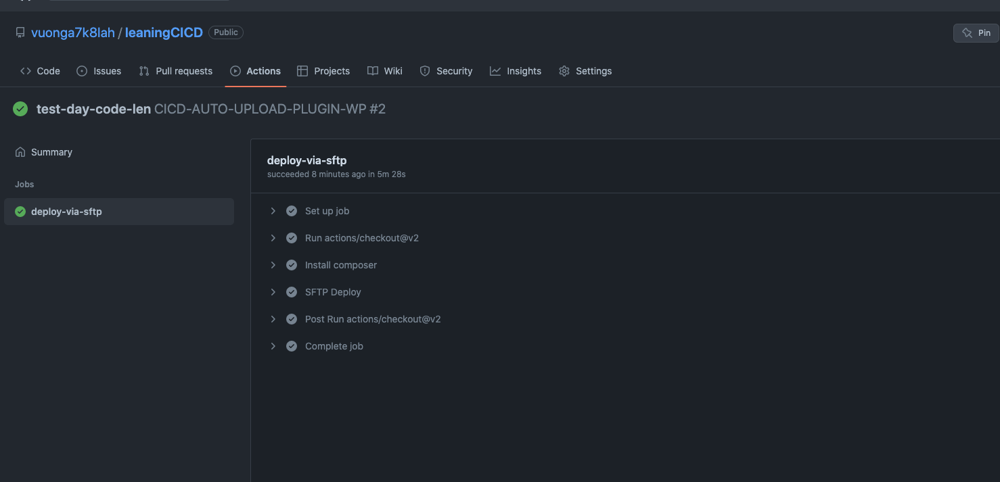

##Quy trình setup đẩy plugin tự động

####Bước1: 
sửa tên thư mục ứng với namespace của plugin trong file wilAction.yml

####Bước2: chạy lệnh sau 

 lưu ý nội dung commit khong duoc viet cach nhau. và phải chú ý các đường dẫn tuyệt đối
####Bước3: lên repo 
https://github.com/vuonga7k8lah/leaningCICD/actions

kiểm tra qua trình deloy và vào lại host để kiểm tra lại plugin

